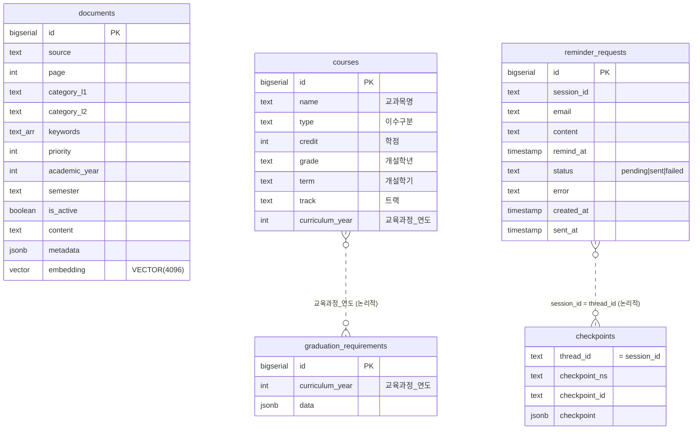

# 데이터베이스 스키마

가천대 인공지능학과 길잡이 AI Agent의 PostgreSQL(16) + pgvector 테이블 설계 문서.
스키마 정의 출처: [`app/db.py`](../app/db.py)(지식·운영 테이블), LangGraph `AsyncPostgresSaver.setup()`(체크포인터).

테이블은 세 그룹으로 나뉜다.

- **① 지식 테이블** — RAG 검색·도구가 참조. `app/ingest.py`가 적재한다.
- **② 운영 테이블** — 런타임 상태(리마인드 예약). 앱 시작 시 `ensure_runtime_schema`로 보장.
- **③ 체크포인터 테이블** — 멀티턴 대화 상태. LangGraph가 자동 생성·관리.

## ER 다이어그램

> 물리적 외래키(FK)로 묶인 정규화 스키마는 아니다. 위 점선은 **논리적 연결**을 나타낸다.
> `documents`는 RAG 검색 독립 테이블이다.

## ① 지식 테이블

### `documents` — RAG 검색 대상 (핵심)

| 컬럼 | 타입 | 설명 |
|---|---|---|
| id | BIGSERIAL PK | |
| source | TEXT NOT NULL | 출처 문서명 |
| page | INT | 페이지 |
| category / category_l1 / category_l2 | TEXT | 2계층 카테고리 (라우터 카테고리 필터) |
| keywords | TEXT[] | 키워드 매칭 (리랭커) |
| priority | INTEGER (기본 2) | 문서 중요도 (리랭커) |
| academic_year | INTEGER | 교육과정 연도 (학번 필터) |
| semester | TEXT | 학기 |
| is_active | BOOLEAN (기본 TRUE) | 활성 문서만 검색 대상 |
| content | TEXT NOT NULL | 청크 본문 |
| metadata | JSONB (기본 `{}`) | 부가 정보 |
| embedding | VECTOR(4096) | Upstage 임베딩 |

- **인덱스**: `idx_documents_category (category_l1, category_l2)`, `idx_documents_active (is_active)`
- **벡터 검색은 인덱스 없이 exact 코사인(`<=>`)** — pgvector HNSW/IVFFlat은 2000차원까지만 지원하는데 Upstage 임베딩이 4096차원이라, 문서 수가 적은 현 규모에선 정확검색을 사용한다(데이터가 커지면 halfvec 전환 고려).

### `courses` — 과목 카탈로그

`recommend_courses` 도구가 학년/학기/트랙으로 조회.

| 컬럼 | 타입 |
|---|---|
| id | BIGSERIAL PK |
| 교과목명 | TEXT NOT NULL |
| 이수구분 | TEXT |
| 학점 / 이론 / 실습 | INT |
| 개설학년 / 개설학기 | TEXT |
| 트랙 | TEXT |
| 교육과정_연도 | INT |

### `graduation_requirements` — 졸업요건

`calc_graduation_progress` 도구가 학번→적용 연도 기준으로 참조. 연도별 요건을 JSONB로 통째 저장.

| 컬럼 | 타입 |
|---|---|
| id | BIGSERIAL PK |
| 교육과정_연도 | INT |
| data | JSONB NOT NULL |

## ② 운영 테이블

### `reminder_requests` — 이메일 리마인드 예약

APScheduler(30초 주기)가 마감된 `pending` 예약을 조회해 Resend로 발송 후 status를 갱신한다.

| 컬럼 | 타입 | 설명 |
|---|---|---|
| id | BIGSERIAL PK | |
| session_id | TEXT | 대화 세션(=thread_id) |
| email | TEXT NOT NULL | 수신자 (발송/실패 후 빈 문자열로 지움 — PII 최소보관) |
| content | TEXT NOT NULL | 메일 본문 (RAG 일정 답변) |
| remind_at | TIMESTAMP NOT NULL | 발송 예정 시각 |
| status | TEXT NOT NULL (기본 `pending`) | `pending` / `sent` / `failed` (CHECK 제약) |
| error | TEXT | 실패 사유 |
| created_at | TIMESTAMP (기본 NOW()) | |
| sent_at | TIMESTAMP | 발송 시각 |

- **부분 인덱스**: `idx_reminder_requests_pending (remind_at) WHERE status = 'pending'` — 스케줄러가 마감 예약만 효율적으로 조회.

## ③ 체크포인터 테이블 (LangGraph)

`AsyncPostgresSaver.setup()`이 자동 생성한다(`checkpoints`, `checkpoint_writes`, `checkpoint_blobs` 등). 멀티턴 대화 상태를 `thread_id`(=`session_id`)별로 영속해, **학번 되묻기**·**리마인드 확인** 같은 멀티턴 흐름에서 이전 상태를 이어간다. 스키마는 LangGraph가 관리하므로 애플리케이션에서 직접 DDL을 정의하지 않는다.

## 관계 요약

정규화 FK 대신 **논리적 연결**로 설계했다.

- `courses` · `graduation_requirements` ↔ **`교육과정_연도`**: 학번을 적용 교육과정 연도로 매핑해 두 테이블을 연도 기준으로 연결.
- `reminder_requests.session_id` · 체크포인터 `thread_id` ↔ **같은 대화 세션 식별자**.
- `documents`: RAG 벡터 검색 전용 독립 테이블.
