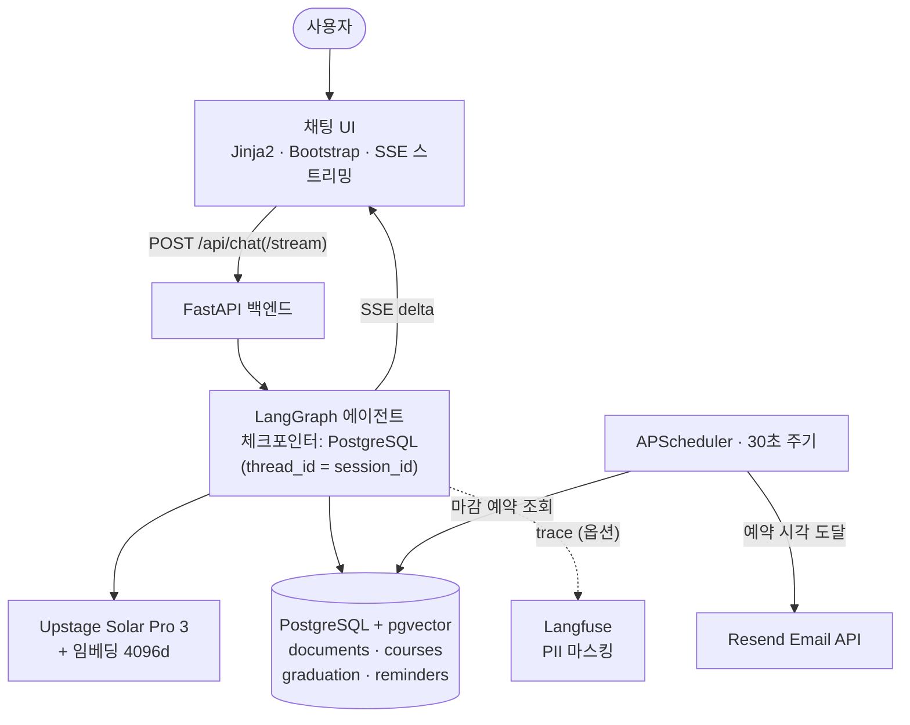
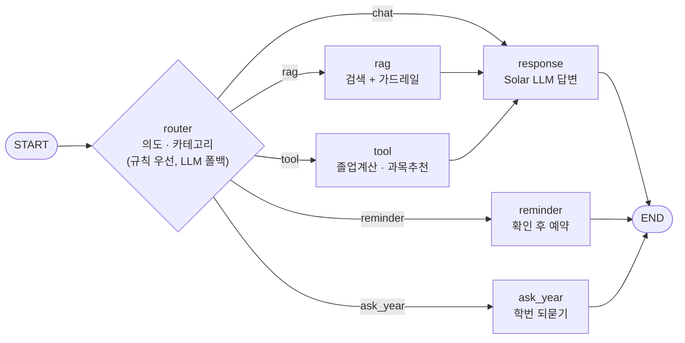
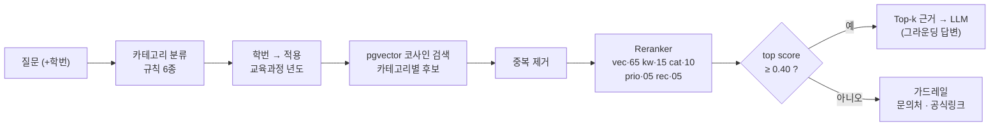
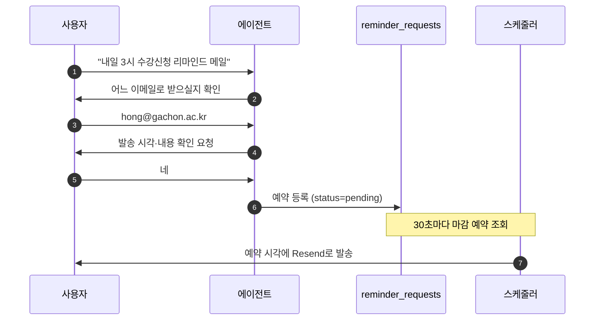

# 시스템 아키텍처

가천대학교 인공지능학과 길잡이 AI 에이전트의 구조 문서. 사용자 질문은 SSE 스트리밍
채팅 UI → FastAPI → LangGraph 에이전트로 흐르며, 검색은 pgvector, 생성은 Upstage
Solar, 리마인드 발송은 스케줄러+Resend가 담당한다. 환각을 구조적으로 억제하고
실행형 작업은 사람 확인을 거치도록 설계했다.

> 발표용 시각 버전(Artifact): 대시보드와 동일 디자인의 인터랙티브 페이지로도 제공.

---

## 1. 전체 구성

---

## 2. LangGraph 라우팅

router가 의도를 분류해 5개 경로로 분기한다. **규칙(`resolve_tool`·카테고리 키워드)이
확정하면 라우터 LLM을 생략**해 지연을 없앤다(측정 p50 0ms). `reminder`·`ask_year`는
결정적 템플릿으로 답을 직접 만들어 응답 LLM을 거치지 않는다(드리프트 방지).

---

## 3. RAG 파이프라인 (멘토링 반영)

2계층 카테고리로 검색 범위를 좁히고, 학번을 보유 교육과정 년도로 매핑해 필터한다.
pgvector 후보를 5요소 경량 reranker로 재정렬하고, 최고 점수가 신뢰 임계값(0.40) 미만이면
답을 지어내지 않고 가드레일(문의처 안내)로 전환한다.

reranker 가중치: `vector 0.65 + keyword 0.15 + category 0.10 + priority 0.05 + recency 0.05`.

---

## 4. 이메일 리마인드 시퀀스 (Human-in-the-loop)

외부 상태를 바꾸는 이메일 발송은 **물어보고 → 확인받고 → 예약** 절차로만 실행한다.
실제 발송은 스케줄러가 예약 시각에 처리하며, 이메일 주소는 개인정보라 LLM에 넘기지 않고
규칙으로만 다룬다(ADR-007).

---

## 5. 신뢰·안전 요소 (Safety & LLMOps)

| 요소 | 내용 |
|---|---|
| **Guardrail** | reranker 점수(pgvector confidence 가중합) < 0.40이면 추측 대신 문의처 안내. 순수 연락처 질문은 항상 정형 데이터로 응답 |
| **Grounding** | 검색 근거·도구 결과 안에서만 답하도록 프롬프트로 강제. 날짜·전화·과목명 임의 생성 금지 |
| **Privacy (ADR-007)** | 이메일·전화는 규칙으로만 추출, LLM·trace에 원본 미전달(Langfuse mask 훅으로 마스킹) |
| **Human-in-the-loop** | 이메일 리마인드는 물어보고→확인받고→발송. 결정적 템플릿으로 일관 동작 |
| **Year-aware** | 졸업요건·교육과정은 학번(입학년도) 기준으로 필터·계산. 자료 없으면 되묻거나 근접 년도로 안내 |
| **Observability** | Langfuse로 라우팅 판단·검색 점수·가드레일 근거를 span 기록(옵션, 기본 비활성) |
| **Eval** | 25 시나리오 × N회 반복으로 라우팅·검색·가드레일·답변 품질 KPI 측정(Tier1/Tier2, `eval/`) |
| **Performance** | 규칙이 의도를 확정하면 라우터 LLM 생략 → 라우팅 지연 p50 0ms |

---

## 6. 기술 스택

| 구분 | 기술 |
|---|---|
| 백엔드 | FastAPI · LangGraph |
| 프론트 | Jinja2 · Bootstrap · SSE |
| LLM | Upstage Solar Pro 3 |
| RAG | PostgreSQL · pgvector (4096d) |
| 임베딩 | Upstage Embedding |
| 이메일 | Resend API |
| 스케줄러 | APScheduler |
| 관측성 | Langfuse |
| 배포 | Docker · Google Cloud Run · GitHub Actions |
